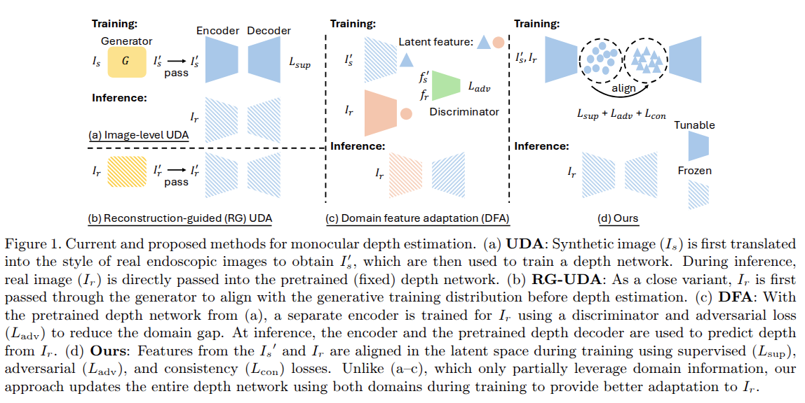

# MDE
Monocular absolute depth estimation from endoscopy via domain-invariant feature learning and latent consistency [arxiv link](https://arxiv.org/abs/2511.02247)

**Core Idea**

Because real endoscopic images (typically) do not have ground truth depth, this work leverages ``synthetically rendered images with known depth`` with ``information from real endoscopic images`` to improve depth estimation performance on real data

**Motivation**
 

**Qualitative results**
 


## Usage

**Installation**
```
conda create -n mde python=3.9
conda activate mde
pip install -r requirements.txt # or conda env create -f environment.yml
```

**Train**

```
python train.py --name <your running name> --json_path <your json file path> --min_depth <your minimum depth value> --max_depth <your maximum depth value> 
```
The code will automatically create a folder to store logs under /src/checkpoints/your running name/

For training the domain alignment version, use ```train_ours.py```. The detailed split information or format can be viewed in ```create_dataset``` folders.

**Test**

```
python test.py
```
you need to change the ```pretrained_path```, ```name``` and other arguments in the script


**Application**

Code for our [MDE](https://github.com/MedICL-VU/MDE) (this repo) and [Segmentation](https://github.com/MedICL-VU/cao_seg/) to better support [SLAM reconstruction](https://github.com/vu-maple-lab/perseus/).

For segmentation, you need to use the manual labels you want, this applies to CAO tumor, BPH lobes, needle, etc.


If you find this repository useful, please consider citing this paper:

MDE

```bibtex
@inproceedings{li2026mde,
  title={Monocular absolute depth estimation from endoscopy via domain-invariant feature learning and latent consistency},
  author = {Li, Hao and Lu, Daiwei and d'Almeida, Jesse and Isik, Dilara and Khodapanah Aghdam, Ehsan and DiSanto, Nick and Acar, Ayberk and Sharma, Susheela and Wu, Jie Ying and Webster III, Robert J. and Oguz, Ipek},
  booktitle={Medical Imaging 2026: Image Processing},
  volume={in press},
  year={2026},
  organization={SPIE}
}
```


Segmentation

```bibtex
@inproceedings{li2025automated,
  title={Automated segmentation of central airway obstruction from endoscopic video stream with deep learning},
  author={Li, Hao and Wang, Jiacheng and Kumar, Nithin and d’Almeida, Jesse and Lu, Daiwei and Acar, Ayberk and Han, John and Yang, Qingyun and Ertop, Tayfun Efe and Wu, Jie Ying and others},
  booktitle={Medical Imaging 2025: Image-Guided Procedures, Robotic Interventions, and Modeling},
  volume={13408},
  pages={113--119},
  year={2025},
  organization={SPIE}
}
